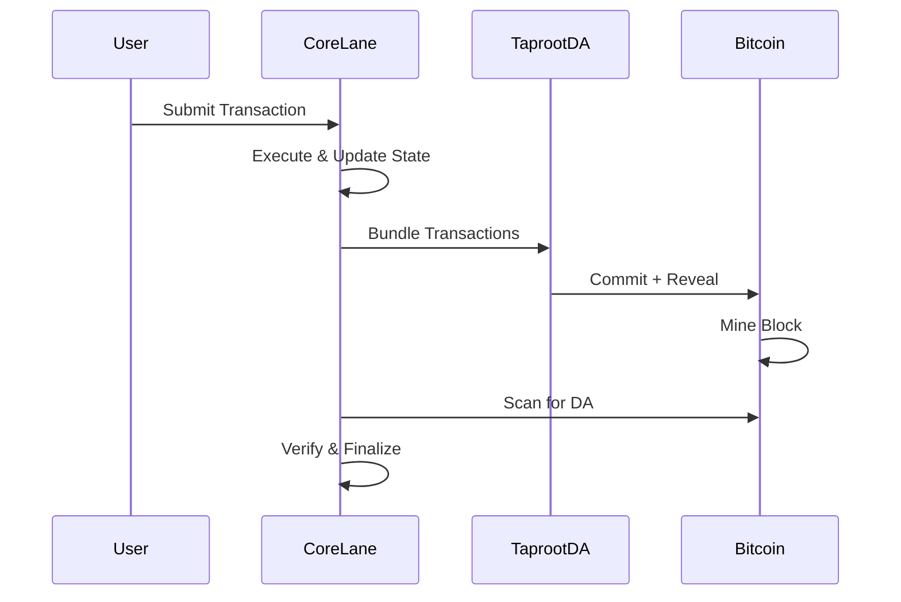

## System Architecture

Core Lane is a Bitcoin-anchored execution environment that processes transactions and maintains state while anchoring to Bitcoin\'s security model. The architecture consists of several key components working together to provide a verifiable execution layer.

### Core Components

The system is organized into distinct modules, each handling specific responsibilities:

<CardGroup cols={2}>
  <Card title="State Management" icon="database">
    Manages account balances, nonces, and state transitions
  </Card>
  <Card title="Taproot DA" icon="bitcoin">
    Embeds data in Bitcoin using Taproot for availability
  </Card>
  <Card title="Intent System" icon="bolt">
    Enables cross-chain operations and async execution
  </Card>
  <Card title="Transaction Processing" icon="gears">
    Executes and validates transactions with nonce ordering
  </Card>
</CardGroup>

## High-Level Flow



## Module Organization

The codebase is structured around these core modules (src/lib.rs:16-25):

- **`account`** - Account structure and balance management
- **`state`** - State manager and bundle state for atomic updates
- **`transaction`** - Transaction execution and validation logic
- **`intents`** - Intent-based transaction system for async operations
- **`taproot_da`** - Bitcoin data availability using Taproot envelopes
- **`block`** - Block processing, bundle encoding/decoding
- **`bitcoin_block`** - Bitcoin block scanning and data extraction

## State Architecture

### Two-Layer State Management

Core Lane uses a dual-layer state system for atomic transaction processing:

1. **`StateManager`** (src/state.rs:86-94) - The canonical, persistent state:
   ```rust
   pub struct StateManager {
       accounts: BTreeMap<Address, CoreLaneAccount>,
       stored_blobs: BTreeMap<B256, Vec<u8>>,
       kv_storage: BTreeMap<String, Vec<u8>>,
       intents: BTreeMap<B256, Intent>,
       transactions: Vec<StoredTransaction>,
       transaction_receipts: BTreeMap<String, TransactionReceipt>,
   }
   ```

2. **`BundleStateManager`** (src/state.rs:96-105) - Temporary state for transaction bundles:
   - Accumulates changes during bundle execution
   - Provides rollback capability if bundle fails
   - Merges into StateManager only on success

<Note>
The bundle state pattern ensures atomicity - either all transactions in a bundle succeed, or none do. This is critical for maintaining state consistency.
</Note>

### State Application Process

Changes flow from bundle state to main state (src/state.rs:388-421):

```rust
pub fn apply_changes(&mut self, bundle_state_manager: BundleStateManager) {
    // Apply account changes
    for (address, account) in bundle_state_manager.accounts.into_iter() {
        self.set_account(address, account);
    }
    // Apply blob storage, intents, KV storage, transactions, receipts
    // ...
}
```

## Data Flow

### Transaction Lifecycle

1. **Submission** - Raw transaction submitted to Core Lane node
2. **Validation** - Signature verification, nonce checking (src/transaction.rs:239-258)
3. **Execution** - State changes applied to `BundleStateManager`
4. **Bundling** - Transactions grouped into bundles with CBOR encoding
5. **DA Commitment** - Bundle data embedded in Bitcoin via Taproot
6. **Finalization** - Bundle state applied to StateManager after Bitcoin confirmation

### Bitcoin Anchoring Flow

See [Bitcoin Anchoring](/concepts/bitcoin-anchoring) for detailed information on how data is committed to Bitcoin.

## Execution Context

The `ProcessingContext` trait (src/transaction.rs:96-106) abstracts state access:

```rust
pub trait ProcessingContext {
    fn state_manager(&self) -> &StateManager;
    fn state_manager_mut(&mut self) -> &mut StateManager;
    fn bitcoin_client_read(&self) -> Option<Arc<dyn BitcoinRpcReadClient>>;
    fn bitcoin_network(&self) -> bitcoin::Network;
    fn handle_cmio_query(...) -> Option<CmioMessage>;
}
```

This allows both:
- **Full nodes** - with complete state and Bitcoin RPC access
- **External sequencers** - using the library for transaction processing

## Key Addresses

Core Lane reserves special addresses for system operations (src/transaction.rs:108-136):

- **Burn Address**: `0x0000000000000000000000000000000000000666` - For cross-chain burns
- **Intent System**: `0x0000000000000000000000000000000000000045` - Intent management
- **Cartesi Runner**: `0x0000000000000000000000000000000000000042` - RISC-V program execution

<Warning>
Transactions to these addresses have special handling logic. Regular transfers will fail.
</Warning>

## Serialization

Core Lane uses **Borsh** for efficient state serialization (src/state.rs:437-467):

- Deterministic encoding for state commitments
- Compact binary format for storage efficiency
- Used for state persistence and cross-chain proofs

## Library Usage

Core Lane can be used as a library for custom sequencers (src/lib.rs:53-106):

```rust
use core_lane::{CoreLaneStateForLib, StateManager, BundleStateManager};
use core_lane::{execute_transaction, TxEnvelope};

let mut state = CoreLaneStateForLib::new(
    StateManager::new(),
    bitcoin_client_read,
    bitcoin_client_write,
    bitcoin::Network::Regtest
);

let mut bundle = BundleStateManager::new();
// Process transactions using execute_transaction()
```

See the [State Management](/concepts/state-management) section for detailed usage patterns.

## Next Steps

<CardGroup cols={2}>
  <Card title="Bitcoin Anchoring" icon="anchor" href="/concepts/bitcoin-anchoring">
    Learn how Core Lane commits to Bitcoin
  </Card>
  <Card title="State Management" icon="database" href="/concepts/state-management">
    Deep dive into state handling
  </Card>
  <Card title="Intent System" icon="bolt" href="/concepts/intent-system">
    Understand async cross-chain operations
  </Card>
  <Card title="Transaction Processing" icon="gears" href="/concepts/transaction-processing">
    Explore execution flow
  </Card>
</CardGroup>