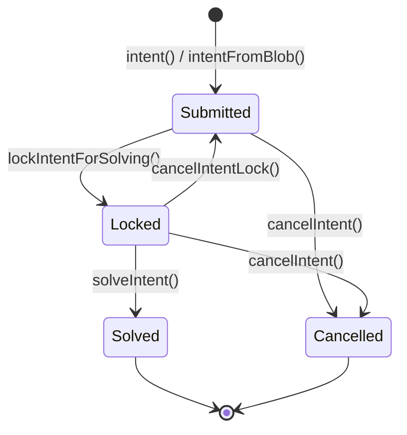

## Overview

Core Lane\'s intent system enables **asynchronous execution** and **cross-chain coordination** through a marketplace model where users express desired outcomes (intents) and solvers compete to fulfill them.

## What are Intents?

An **intent** is a user\'s declaration of a desired outcome with locked value, without specifying the execution path. The system manages the lifecycle from submission to fulfillment.

### Intent Types

Core Lane supports multiple intent types (src/intents.rs:42-47):

```rust
pub enum IntentType {
    AnchorBitcoinFill = 1,  // Bitcoin-to-Core Lane bridge
    RiscVProgram = 2,       // RISC-V program execution with custom logic
}
```

<CardGroup cols={2}>
  <Card title="AnchorBitcoinFill" icon="bitcoin">
    Cross-chain fills: User requests Bitcoin payment, solver delivers BTC for locked Core Lane tokens
  </Card>
  <Card title="RiscVProgram" icon="microchip">
    Programmable intents: Custom verification logic running in Cartesi VM
  </Card>
</CardGroup>

## Intent Structure

The `Intent` struct tracks intent state (src/intents.rs:411-423):

```rust
pub struct Intent {
    pub data: Bytes,                  // CBOR-encoded intent data
    pub value: u64,                   // Locked value in wei (currently u64, max ~18.4 ETH)
    pub status: IntentStatus,         // Current lifecycle state
    pub last_command: IntentCommandType,  // Last operation performed
    pub creator: Address,             // Intent creator's address
}
```

### Intent Status

Intents transition through states (src/intents.rs:386-396):

```rust
pub enum IntentStatus {
    Submitted,           // Intent created, awaiting solver
    Locked(Address),     // Solver has locked for solving
    Solved,              // Successfully fulfilled
    Cancelled,           // Cancelled by creator
}
```



## Intent System Interface

The intent system is accessed via a special contract address (src/intents.rs:12-29):

```solidity
interface IntentSystem {
    // Blob storage (for large data)
    function storeBlob(bytes data, uint256 expiryTime) payable;
    function prolongBlob(bytes32 blobHash) payable;
    function blobStored(bytes32 blobHash) view returns (bool);
    
    // Intent creation
    function intent(bytes intentData, uint256 nonce) payable returns (bytes32 intentId);
    function intentFromBlob(bytes32 blobHash, uint256 nonce, bytes extraData) payable returns (bytes32);
    function createIntentAndLock(bytes eip712sig, bytes lockData) returns (bytes32 intentId);
    
    // Intent lifecycle
    function cancelIntent(bytes32 intentId, bytes data) payable;
    function lockIntentForSolving(bytes32 intentId, bytes data) payable;
    function solveIntent(bytes32 intentId, bytes data) payable;
    function cancelIntentLock(bytes32 intentId, bytes data) payable;
    
    // Query functions
    function isIntentSolved(bytes32 intentId) view returns (bool);
    function intentLocker(bytes32 intentId) view returns (address);
    function valueStoredInIntent(bytes32 intentId) view returns (uint256);
}
```

Accessed at: **`0x0000000000000000000000000000000000000045`** (src/transaction.rs:122-128)

## Intent Creation

### Method 1: Direct Intent Submission

Submit intent with inline data (src/transaction.rs:599-653):

```rust
IntentCall::Intent { intent_data, .. } => {
    // Check balance
    if bundle_state.get_balance(state.state_manager(), sender) < value {
        return Err("Insufficient balance");
    }
    
    // Lock value
    bundle_state.sub_balance(state.state_manager(), sender, value)?;
    bundle_state.increment_nonce(state.state_manager(), sender)?;
    
    // Calculate intent ID
    let intent_id = calculate_intent_id(sender, nonce, Bytes::from(intent_data.clone()));
    
    // Create intent
    bundle_state.insert_intent(
        intent_id,
        Intent {
            data: Bytes::from(intent_data),
            value: value_u64,
            status: IntentStatus::Submitted,
            last_command: IntentCommandType::Created,
            creator: sender,
        },
    );
}
```

**Intent ID Calculation** (prevents collisions):

```rust
fn calculate_intent_id(creator: Address, nonce: u64, data: Bytes) -> B256 {
    keccak256(abi.encode(creator, nonce, data))
}
```

### Method 2: Intent from Blob

For large intent data, store in blob first (src/transaction.rs:480-519):

```rust
// Step 1: Store blob
IntentCall::StoreBlob { data, .. } => {
    let blob_hash = keccak256(&data);
    bundle_state.insert_blob(blob_hash, data.clone());
    bundle_state.increment_nonce(state.state_manager(), sender)?;
}

// Step 2: Create intent from blob
IntentCall::IntentFromBlob { blob_hash, extra_data, .. } => {
    if !bundle_state.contains_blob(state.state_manager(), &blob_hash) {
        return Err("Blob not stored");
    }
    
    // Intent ID includes blob hash
    let mut preimage = Vec::new();
    preimage.extend_from_slice(blob_hash.as_slice());
    preimage.extend_from_slice(&extra_data);
    
    let intent_id = calculate_intent_id(sender, nonce, Bytes::from(preimage));
    
    bundle_state.insert_intent(
        intent_id,
        Intent {
            data: Bytes::from(extra_data),  // Only extra_data stored
            value: value_u64,
            status: IntentStatus::Submitted,
            last_command: IntentCommandType::Created,
            creator: sender,
        },
    );
}
```

<Info>
Blob storage is useful for RISC-V programs where the program binary is large but the execution parameters are small.
</Info>

### Method 3: EIP-712 Signed Intent

Create and lock in one transaction using a signature (src/transaction.rs:323-478):

```rust
IntentCall::CreateIntentAndLock { eip712sig, lock_data } => {
    // Parse signed payload (CBOR format)
    let signed_payload: SignedPayload = ciborium::de::from_reader(lock_data.as_slice())?;
    
    // Verify EIP-712 signature
    let domain = Eip712Domain {
        name: Some(Cow::Borrowed("CoreLaneIntent")),
        version: Some(Cow::Borrowed("1")),
        chain_id: Some(U256::from(1281453634u64)),
        verifying_contract: Some(CoreLaneAddresses::exit_marketplace()),
        salt: None,
    };
    
    let digest = eip712_digest(&domain, &signed_payload.intent, 
                               signed_payload.nonce, signed_payload.value);
    let signer = recover_signer_from_digest(&digest, &eip712sig)?;
    
    // Validate nonce and balance
    let expected_nonce = bundle_state.get_nonce(state.state_manager(), signer);
    if expected_nonce != signed_payload.nonce {
        return Err("Invalid nonce");
    }
    
    if bundle_state.get_balance(state.state_manager(), signer) < signed_payload.value {
        return Err("Insufficient balance");
    }
    
    // Lock value and create intent in Locked state
    bundle_state.sub_balance(state.state_manager(), signer, signed_payload.value)?;
    let intent_id = calculate_intent_id(signer, nonce_u64, Bytes::from(signed_payload.intent.clone()));
    
    bundle_state.insert_intent(
        intent_id,
        Intent {
            data: Bytes::from(signed_payload.intent),
            value: value_u64,
            status: IntentStatus::Locked(signer),  // Already locked by creator
            last_command: IntentCommandType::LockIntentForSolving,
            creator: signer,
        },
    );
}
```

<Note>
EIP-712 signed intents allow gasless submission - someone else can submit the transaction on behalf of the signer.
</Note>

## Intent Lifecycle Operations

### Locking for Solving

Solvers lock intents to prevent competition (src/transaction.rs:673-792):

```rust
IntentCall::LockIntentForSolving { intent_id, .. } => {
    let intent = bundle_state.get_intent(state.state_manager(), &intent_id)
        .ok_or("Intent not found")?;
    
    match intent.status {
        IntentStatus::Submitted => {
            // Lock for solving
            if let Some(intent) = bundle_state.get_intent_mut(state.state_manager(), &intent_id) {
                intent.status = IntentStatus::Locked(sender);
                intent.last_command = IntentCommandType::LockIntentForSolving;
            }
            bundle_state.increment_nonce(state.state_manager(), sender)?;
        }
        IntentStatus::Locked(_) => return Err("Already locked"),
        IntentStatus::Solved => return Err("Already solved"),
        IntentStatus::Cancelled => return Err("Cancelled"),
    }
}
```

### Solving Intents

Solvers provide proof of fulfillment:

#### AnchorBitcoinFill

Requires Bitcoin L1 verification (src/transaction.rs:849-928):

```rust
IntentType::AnchorBitcoinFill => {
    // data contains: block_height (8 bytes) + txid (32 bytes)
    let block_number = u64::from_le_bytes(data[..8]);
    let txid_bytes: [u8; 32] = data[8..40];
    
    // Verify Bitcoin transaction exists and pays to correct address
    if verify_intent_fill_on_bitcoin(state, intent_id, block_number, txid_bytes)? {
        // Release intent value to solver
        bundle_state.add_balance(state.state_manager(), sender, U256::from(intent_value))?;
        
        // Mark as solved
        if let Some(intent) = bundle_state.get_intent_mut(state.state_manager(), &intent_id) {
            intent.status = IntentStatus::Solved;
            intent.last_command = IntentCommandType::SolveIntent;
        }
        bundle_state.increment_nonce(state.state_manager(), sender)?;
    } else {
        return Err("L1 fill not found in block");
    }
}
```

<Info>
Bitcoin verification uses the Bitcoin RPC client to fetch blocks and scan for matching payment transactions.
</Info>

#### RiscVProgram

Executes program for custom verification (src/transaction.rs:930-987):

```rust
IntentType::RiscVProgram => {
    // Release value to solver
    bundle_state.add_balance(state.state_manager(), sender, U256::from(intent_value))?;
    
    // Mark as solved
    if let Some(intent) = bundle_state.get_intent_mut(state.state_manager(), &intent_id) {
        intent.status = IntentStatus::Solved;
        intent.last_command = IntentCommandType::SolveIntent;
    }
    bundle_state.increment_nonce(state.state_manager(), sender)?;
    
    // Run RISC-V program for permission check (if Cartesi enabled)
    #[cfg(feature = "cartesi-runner")]
    {
        let permission = check_riscv_intent_permission(
            bundle_state, state, &cbor_intent, intent_id
        )?;
        
        if permission == 1 {
            return Err("Permission denied by RISC-V program");
        }
    }
}
```

<Warning>
RISC-V programs can reject solve attempts even after state changes, so permission checks happen last.
</Warning>

### Cancelling Intents

Creators can cancel unsolved intents (src/transaction.rs:990-1088):

```rust
IntentCall::CancelIntent { intent_id, .. } => {
    let intent = bundle_state.get_intent(state.state_manager(), &intent_id)
        .ok_or("Intent not found")?;
    
    // Verify caller is creator
    if intent.creator != sender {
        return Err("Not creator");
    }
    
    // Cannot cancel solved intents
    if matches!(intent.status, IntentStatus::Solved) {
        return Err("Already solved");
    }
    
    // For RiscVProgram intents, run permission check
    #[cfg(feature = "cartesi-runner")]
    if intent_type == IntentType::RiscVProgram {
        let permission = check_riscv_intent_permission(bundle_state, state, &intent_data, intent_id)?;
        if permission == 1 {
            return Err("Permission denied by RISC-V program");
        }
    }
    
    // Refund value to creator
    bundle_state.add_balance(state.state_manager(), intent.creator, U256::from(intent.value))?;
    
    // Mark as cancelled
    if let Some(intent_mut) = bundle_state.get_intent_mut(state.state_manager(), &intent_id) {
        intent_mut.status = IntentStatus::Cancelled;
        intent_mut.last_command = IntentCommandType::CancelIntent;
    }
    
    bundle_state.increment_nonce(state.state_manager(), sender)?;
}
```

### Unlocking Intents

Solvers can release locks if unable to solve (src/transaction.rs:1090-1157):

```rust
IntentCall::CancelIntentLock { intent_id, .. } => {
    let intent = bundle_state.get_intent(state.state_manager(), &intent_id)
        .ok_or("Intent not found")?;
    
    match intent.status {
        IntentStatus::Locked(locker) => {
            if locker != sender {
                return Err("Not current locker");
            }
            
            // For RiscVProgram, run permission check
            #[cfg(feature = "cartesi-runner")]
            if intent_type == IntentType::RiscVProgram {
                let permission = check_riscv_intent_permission(bundle_state, state, &intent_data, intent_id)?;
                if permission == 1 {
                    return Err("Permission denied by RISC-V program");
                }
            }
            
            // Unlock intent
            if let Some(intent_mut) = bundle_state.get_intent_mut(state.state_manager(), &intent_id) {
                intent_mut.status = IntentStatus::Submitted;
                intent_mut.last_command = IntentCommandType::CancelIntentLock;
            }
            bundle_state.increment_nonce(state.state_manager(), sender)?;
        }
        _ => return Err("Not locked"),
    }
}
```

## Intent Data Formats

### AnchorBitcoinFill

CBOR-encoded structure (src/intents.rs:87-92):

```rust
pub struct AnchorBitcoinFill {
    pub bitcoin_address: Vec<u8>,  // Bitcoin address (UTF-8 string bytes)
    pub amount: U256,              // Requested BTC amount in sats
    pub max_fee: U256,             // Maximum acceptable fee
    pub expire_by: u64,            // Expiration timestamp
}
```

**Creation helper** (src/intents.rs:163-177):

```rust
pub fn create_anchor_bitcoin_fill_intent(
    bitcoin_address: &str,
    amount: U256,
    max_fee: U256,
    expire_by: u64,
) -> Result<IntentData> {
    let fill_data = AnchorBitcoinFill::from_bitcoin_address(
        bitcoin_address, amount, max_fee, expire_by
    )?;
    let fill_cbor = fill_data.to_cbor()?;
    
    Ok(IntentData {
        intent_type: IntentType::AnchorBitcoinFill,
        data: fill_cbor,
    })
}
```

### RiscVProgramIntent

CBOR-encoded structure (src/intents.rs:94-98):

```rust
pub struct RiscVProgramIntent {
    pub blob_hash: [u8; 32],  // Hash of stored RISC-V program
    pub extra_data: Vec<u8>,  // Program execution parameters
}
```

The blob_hash references a program stored via `storeBlob()`. The extra_data contains execution-specific parameters.

## Intent Queries

Read-only queries for intent state (src/transaction.rs:655-671):

```rust
IntentCall::IsIntentSolved { intent_id } => {
    let solved = match bundle_state.get_intent(state.state_manager(), &intent_id) {
        Some(intent) => matches!(intent.status, IntentStatus::Solved),
        None => false,
    };
    
    // Return as 32-byte boolean (0 or 1 in last byte)
    let mut ret = vec![0u8; 32];
    if solved {
        ret[31] = 1;
    }
    return Ok(ExecutionResult {
        success: true,
        output: Bytes::from(ret),
        ...
    });
}
```

Similar implementations exist for `intentLocker()` and `valueStoredInIntent()`.

## State Storage

Intents are stored in both state managers:

- **StateManager** - Persistent intent storage (src/state.rs:91)
- **BundleStateManager** - Temporary intent changes during bundle execution (src/state.rs:102)

### Intent Retrieval

Bundle state provides copy-on-write semantics (src/state.rs:140-168):

```rust
pub fn get_intent_mut(
    &mut self,
    original: &StateManager,
    intent_id: &B256,
) -> Option<&mut Intent> {
    // Ensure intent exists in bundle before getting mutable reference
    if !self.intents.contains_key(intent_id) {
        if let Some(orig_intent) = original.get_intent(intent_id) {
            self.intents.insert(*intent_id, orig_intent.clone());
        } else {
            return None;
        }
    }
    self.intents.get_mut(intent_id)
}
```

## Security Considerations

### Value Limits

<Warning>
Intent values are currently limited to u64::MAX (~18.4 ETH in wei). Values exceeding this are rejected (src/transaction.rs:418-430, 553-567, 613-625).
</Warning>

TODO: Migrate to U256 for arbitrary values.

### Nonce Validation

Intent creation increments nonce to prevent replay:

```rust
bundle_state.increment_nonce(state.state_manager(), sender)?;
```

### Permission Checks

RISC-V programs can enforce custom permissions on lock/solve/cancel operations, preventing unauthorized state changes even by intent creators.

## Example: Bitcoin Bridge Intent

```rust
// User wants to receive 0.001 BTC
let intent_data = create_anchor_bitcoin_fill_intent(
    "bc1qxy2kgdygjrsqtzq2n0yrf2493p83kkfjhx0wlh",  // User's BTC address
    U256::from(100_000),  // 100,000 sats = 0.001 BTC
    U256::from(1000),     // Max 1000 sat fee
    1735689600,           // Expires Jan 1, 2025
)?;

// User submits intent with 0.001 laneBTC locked
// (0.001 BTC * 10^8 sats/BTC * 10^10 wei/sat = 10^15 wei)
let call_data = IntentSystem::intentCall::new(
    intent_data.to_cbor()?,
    U256::from(0),  // nonce (fetched from state)
).abi_encode();

let tx = /* EIP-1559 transaction to 0x...0045 with value=10^15 wei */;

// Solver sees intent, sends 0.001 BTC to user's address
// Solver then calls solveIntent with Bitcoin txid proof
let solve_data = [block_height_bytes, txid_bytes].concat();
let solve_call = IntentSystem::solveIntentCall::new(intent_id, solve_data).abi_encode();

// If verified, solver receives 10^15 wei locked in intent
```

## Next Steps

<CardGroup cols={2}>
  <Card title="Transaction Processing" icon="gears" href="/concepts/transaction-processing">
    See how intent calls are executed
  </Card>
  <Card title="State Management" icon="database" href="/concepts/state-management">
    Learn how intents are stored
  </Card>
</CardGroup>