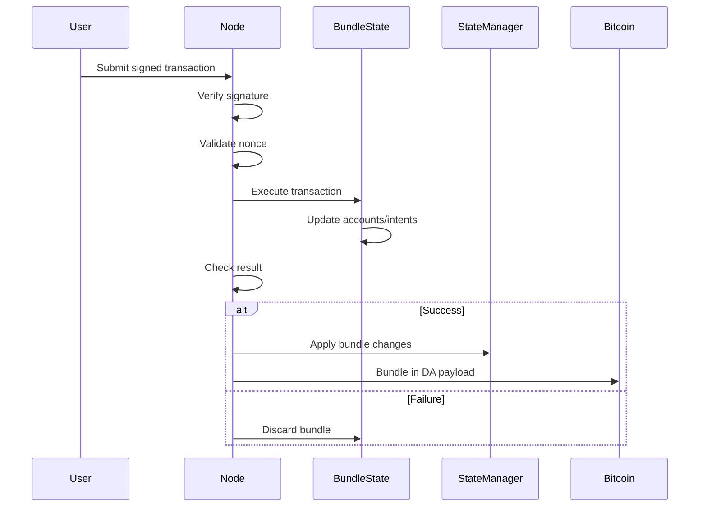

## Overview

Core Lane processes Ethereum-compatible transactions (EIP-1559, Legacy, EIP-2930) with special handling for system addresses and intents. All transactions must pass signature verification, nonce validation, and balance checks.

## Transaction Flow



## Transaction Types

Core Lane supports all Ethereum transaction formats via `alloy_consensus::TxEnvelope`:

- **Legacy** - Pre-EIP-2718 transactions (type 0)
- **EIP-2930** - Access list transactions (type 1)
- **EIP-1559** - Fee market transactions (type 2)
- **EIP-4844** - Blob transactions (type 3, limited support)

## Execution Entry Point

The main execution function (src/transaction.rs:151-159):

```rust
pub fn execute_transaction<T: ProcessingContext>(
    tx: &TxEnvelope,
    sender: Address,
    bundle_state: &mut BundleStateManager,
    state: &mut T,
    block_timestamp: u64,
) -> Result<ExecutionResult> {
    execute_transfer(tx, sender, bundle_state, state, block_timestamp)
}
```

### ExecutionResult

Execution returns a result structure (src/transaction.rs:138-148):

```rust
pub struct ExecutionResult {
    pub success: bool,         // Transaction success/failure
    pub gas_used: U256,        // Gas consumed (currently fixed 21000)
    pub gas_refund: U256,      // Gas refunded (currently 0)
    pub output: Bytes,         // Return data
    pub logs: Vec<String>,     // Execution logs
    pub error: Option<String>, // Error message if failed
}
```

## Validation Phase

### Nonce Validation

Critical for preventing replay attacks (src/transaction.rs:239-258):

```rust
let tx_nonce = get_transaction_nonce(tx);
let expected_nonce = bundle_state.get_nonce(state.state_manager(), sender);

if U256::from(tx_nonce) != expected_nonce {
    return Ok(ExecutionResult {
        success: false,
        gas_used,
        gas_refund: U256::ZERO,
        output: Bytes::new(),n        logs: vec![format!("Invalid nonce: expected {}, got {}", expected_nonce, tx_nonce)],
        error: Some(format!("Invalid nonce: expected {}, got {}", expected_nonce, tx_nonce)),
    });
}
```

<Warning>
Nonce mismatches cause immediate transaction rejection without state changes.
</Warning>

### Transaction Field Extraction

Helper functions extract fields from different transaction types (src/transaction.rs:74-221):

```rust
// Get calldata
pub fn get_transaction_input_bytes(tx: &TxEnvelope) -> Vec<u8> {
    match tx {
        TxEnvelope::Legacy(signed) => signed.tx().input.as_ref().to_vec(),
        TxEnvelope::Eip1559(signed) => signed.tx().input.as_ref().to_vec(),
        TxEnvelope::Eip2930(signed) => signed.tx().input.as_ref().to_vec(),
        TxEnvelope::Eip4844(_) => Vec::new(),
        _ => Vec::new(),
    }
}

// Get nonce
pub fn get_transaction_nonce(tx: &TxEnvelope) -> u64 {
    match tx {
        TxEnvelope::Legacy(signed) => signed.tx().nonce,
        TxEnvelope::Eip1559(signed) => signed.tx().nonce,
        TxEnvelope::Eip2930(signed) => signed.tx().nonce,
        _ => 0,
    }
}

// Get value
fn get_transaction_value(tx: &TxEnvelope) -> U256 {
    match tx {
        TxEnvelope::Legacy(signed) => signed.tx().value,
        TxEnvelope::Eip1559(signed) => signed.tx().value,
        TxEnvelope::Eip2930(signed) => signed.tx().value,
        TxEnvelope::Eip4844(_) => U256::ZERO,
        _ => U256::ZERO,
    }
}

// Get recipient
fn get_transaction_to(tx: &TxEnvelope) -> Option<Address> {
    match tx {
        TxEnvelope::Legacy(signed) => signed.tx().to.into(),
        TxEnvelope::Eip1559(signed) => signed.tx().to.into(),
        TxEnvelope::Eip2930(signed) => signed.tx().to.into(),
        TxEnvelope::Eip4844(_) => None,
        _ => None,
    }
}
```

## Execution Routing

Transactions route to different handlers based on recipient address (src/transaction.rs:260-307):

### Special Addresses

```rust
pub struct CoreLaneAddresses;

impl CoreLaneAddresses {
    /// 0x0000000000000000000000000000000000000666
    pub fn burn() -> Address { /* ... */ }
    
    /// 0x0000000000000000000000000000000000000045
    pub fn exit_marketplace() -> Address { /* ... */ }
    
    /// 0x0000000000000000000000000000000000000042
    pub fn cartesi_http_runner() -> Address { /* ... */ }
}
```

### Routing Logic

```rust
let to = get_transaction_to(tx).ok_or("No recipient")?;

if to == CoreLaneAddresses::cartesi_http_runner() {
    // Execute Cartesi HTTP runner (if feature enabled)
    #[cfg(feature = "cartesi-runner")]
    return execute_cartesi_http_runner(...);
    
    #[cfg(not(feature = "cartesi-runner"))]
    return Err("Cartesi support disabled");
}

if to == CoreLaneAddresses::exit_marketplace() {
    // Decode and execute intent system call
    let input = Bytes::from(get_transaction_input_bytes(tx));
    match decode_intent_calldata(&input) {
        Some(intent_call) => { /* handle intent */ }
        None => return Err("Unknown intent call"),
    }
}

// Otherwise, reject (no arbitrary transfers yet)
return Err("Unsupported recipient");
```

<Note>
Currently, only system addresses are supported. Future versions may enable arbitrary transfers.
</Note>

## Intent System Execution

Transactions to `0x...0045` execute intent operations. See [Intent System](/concepts/intent-system) for full details.

### Intent Call Decoding

Calldata decoded using Alloy's ABI decoder (src/intents.rs:246-384):

```rust
pub fn decode_intent_calldata(calldata: &[u8]) -> Option<IntentCall> {
    use alloy_sol_types::SolCall as _;
    let selector = extract_selector(calldata)?;  // First 4 bytes
    
    match selector {
        IntentSystem::storeBlobCall::SELECTOR => {
            let call = IntentSystem::storeBlobCall::abi_decode(calldata).ok()?;
            Some(IntentCall::StoreBlob {
                data: call.data.to_vec(),
                expiry_time: call.expiryTime,
            })
        }
        IntentSystem::intentCall::SELECTOR => {
            let call = IntentSystem::intentCall::abi_decode(calldata).ok()?;
            Some(IntentCall::Intent {
                intent_data: call.intentData.to_vec(),
                nonce: call.nonce,
            })
        }
        IntentSystem::solveIntentCall::SELECTOR => {
            let call = IntentSystem::solveIntentCall::abi_decode(calldata).ok()?;
            Some(IntentCall::SolveIntent {
                intent_id: B256::from_slice(call.intentId.as_slice()),
                data: call.data.to_vec(),
            })
        }
        // ... other intent calls
        _ => None,
    }
}
```

### Example: Storing a Blob

```rust
IntentCall::StoreBlob { data, .. } => {
    let blob_hash = keccak256(&data);
    
    // Check if already stored
    if bundle_state.contains_blob(state.state_manager(), &blob_hash) {
        return Ok(ExecutionResult {
            success: true,
            logs: vec![format!("Blob already stored: blob_hash = {}", blob_hash)],
            ...
        });
    }
    
    // Store blob and increment nonce
    bundle_state.insert_blob(blob_hash, data.clone());
    bundle_state.increment_nonce(state.state_manager(), sender)?;
    
    return Ok(ExecutionResult {
        success: true,
        logs: vec![format!("Blob stored: blob_hash = {}", blob_hash)],
        ...
    });
}
```

## Gas Accounting

Currently simplified (src/transaction.rs:237):

```rust
let gas_used = U256::from(21000u64);  // Fixed for all transactions
```

<Warning>
Gas accounting is simplified. Production systems should implement:
- Dynamic gas calculation based on execution complexity
- Gas price validation
- Gas refunds for storage deletions
</Warning>

## State Modifications

All state changes go through `BundleStateManager` for atomicity.

### Balance Transfer Example

```rust
// Lock value in intent
if bundle_state.get_balance(state.state_manager(), sender) < value {
    return Err("Insufficient balance");
}

bundle_state.sub_balance(state.state_manager(), sender, value)?;
// ... intent created with locked value
```

### Nonce Increment

Every successful transaction increments nonce:

```rust
bundle_state.increment_nonce(state.state_manager(), sender)?;
```

This prevents replay attacks and enforces transaction ordering.

## Error Handling

Errors return `ExecutionResult` with `success: false`:

```rust
return Ok(ExecutionResult {
    success: false,
    gas_used,
    gas_refund: U256::ZERO,
    output: Bytes::new(),
    logs: vec!["Insufficient balance for intent lock".to_string()],
    error: Some("Insufficient balance".to_string()),
});
```

<Info>
Errors are not propagated as `Err()` but as `Ok(ExecutionResult { success: false })` to allow graceful transaction rejection without bundle failure.
</Info>

## Transaction Receipts

Receipts created for each transaction (src/state.rs:31-46):

```rust
pub struct TransactionReceipt {
    pub transaction_hash: String,
    pub block_number: u64,
    pub transaction_index: u64,
    pub from: String,
    pub to: Option<String>,
    pub cumulative_gas_used: String,
    pub gas_used: String,
    pub contract_address: Option<String>,
    pub logs: Vec<Log>,
    pub status: String,  // "0x1" success, "0x0" failure
    pub effective_gas_price: String,
    pub tx_type: String,
    pub logs_bloom: String,
}
```

Stored in bundle state and later applied to StateManager.

## Signature Recovery

Signatures recovered during block processing (src/block.rs:729-794):

```rust
pub fn recover_sender(tx: &TxEnvelope) -> anyhow::Result<Address> {
    match tx {
        TxEnvelope::Legacy(signed_tx) => {
            signed_tx.recover_signer()
                .map_err(|e| anyhow!("Failed to recover signer from Legacy tx: {:?}", e))
        }
        TxEnvelope::Eip1559(signed_tx) => {
            signed_tx.recover_signer()
                .map_err(|e| anyhow!("Failed to recover signer from EIP-1559 tx: {:?}", e))
        }
        TxEnvelope::Eip2930(signed_tx) => {
            signed_tx.recover_signer()
                .map_err(|e| anyhow!("Failed to recover signer from EIP-2930 tx: {:?}", e))
        }
        TxEnvelope::Eip4844(signed_tx) => {
            signed_tx.recover_signer()
                .map_err(|e| anyhow!("Failed to recover signer from EIP-4844 tx: {:?}", e))
        }
        _ => Err(anyhow!("Unsupported transaction type for sender recovery")),
    }
}
```

Uses Alloy's built-in ECDSA recovery for all transaction types.

## Bundle Processing

Multiple transactions processed together atomically.

### Bundle Structure

See src/block.rs:42-115:

```rust
pub struct CoreLaneBundle {
    pub valid_for_block: u64,
    pub flash_loan_amount: U256,
    pub flash_loaner_address: Address,
    pub sequencer_payment_recipient: Address,
    pub transactions: Vec<(TxEnvelope, Address, Vec<u8>)>,
    pub signature: Option<[u8; 65]>,  // Optional bundle signature
    pub marker: BundleMarker,          // Head or Standard
}
```

### Bundle Position Markers

```rust
pub enum BundleMarker {
    Head,       // Processed in Phase 1 (sequencer only, before burns)
    Standard,   // Processed in Phase 3 (with non-sequencer bundles)
}
```

Different bundle types processed at different times during block finalization.

## Cartesi Integration

With `cartesi-runner` feature enabled, transactions can execute RISC-V programs.

### Cartesi HTTP Runner

Transactions to `0x...0042` execute in Cartesi VM (src/transaction.rs:274-293):

```rust
#[cfg(feature = "cartesi-runner")]
if to == CoreLaneAddresses::cartesi_http_runner() {
    let input = Bytes::from(get_transaction_input_bytes(tx));
    let bundle_state_arc = Arc::new(std::sync::Mutex::new(bundle_state.clone()));
    
    let result = tokio::task::block_in_place(|| {
        tokio::runtime::Handle::current().block_on(
            execute_cartesi_http_runner(
                input,
                gas_used,
                state,
                bundle_state_arc.clone(),
                block_timestamp,
            )
        )
    });
    
    // Sync bundle state back
    *bundle_state = bundle_state_arc.lock().unwrap().clone();
    return result;
}
```

See Cartesi documentation for VM execution details.

## Transaction Validation Checklist

Before execution:

- [ ] Signature valid (recovered sender matches expected)
- [ ] Nonce matches expected value
- [ ] Recipient address is valid (system address or future: any address)
- [ ] Calldata decodes correctly (for intent calls)
- [ ] Sender has sufficient balance (for value transfers)

During execution:

- [ ] State changes applied to bundle state
- [ ] Nonce incremented on success
- [ ] Error handling prevents state corruption
- [ ] Logs/receipts generated

After execution:

- [ ] Bundle state contains all changes
- [ ] ExecutionResult indicates success/failure
- [ ] No exceptions thrown (errors returned as results)

## Performance Considerations

### Transaction Decoding

Alloy's `TxEnvelope::decode()` is efficient:

```rust
let mut slice: &[u8] = tx_data;
match TxEnvelope::decode(&mut slice) {
    Ok(tx) => { /* process */ }
    Err(_) => { /* reject */ }
}
```

### Bundle State Overhead

Copy-on-write for modified accounts:

- **Best case**: Bundle modifies few accounts, minimal overhead
- **Worst case**: Bundle modifies many accounts, significant copying
- **Typical**: Most bundles touch fewer than 100 accounts, acceptable overhead

### Parallel Execution (Future)

Current design is sequential, but future optimizations could include:

- Parallel transaction execution with conflict detection
- Speculative execution with rollback
- Account-level locking for concurrency

## Testing

Transaction processing tested via integration tests (not shown in provided code). Key test scenarios:

1. **Valid transaction** - Executes and increments nonce
2. **Invalid nonce** - Rejected without state change
3. **Insufficient balance** - Rejected with error
4. **Unknown recipient** - Rejected
5. **Malformed calldata** - Rejected with parse error
6. **Intent lifecycle** - Create, lock, solve, cancel flows

## Next Steps

<CardGroup cols={2}>
  <Card title="Intent System" icon="bolt" href="/concepts/intent-system">
    Learn about intent-based transactions
  </Card>
  <Card title="State Management" icon="database" href="/concepts/state-management">
    Understand state changes during execution
  </Card>
  <Card title="Bitcoin Anchoring" icon="anchor" href="/concepts/bitcoin-anchoring">
    See how transactions are anchored to Bitcoin
  </Card>
</CardGroup>